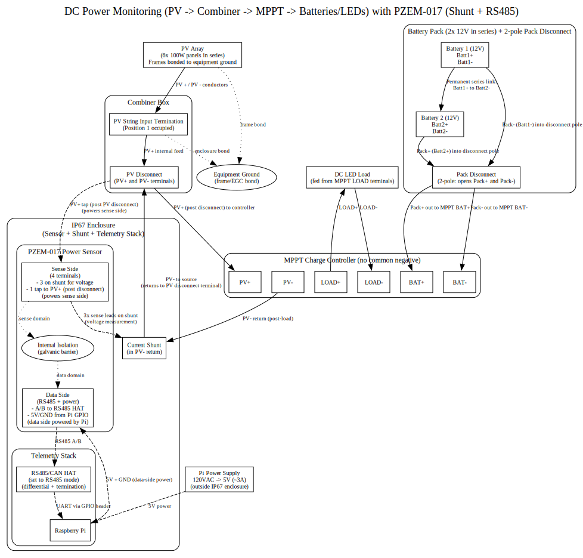

# DC Monitoring Stack

## Overview

This project aims to be an open source DC power sensor you can build from accessible components (Raspberry Pi + shunt + PZEM-017 DC power sensor), with a simple software stack that turns raw measurements into dashboards.

End-to-end goal: Raspberry Pi + RS485 CAN HAT / RS485 USB adapter → shunt/sensor wiring → sensor polling over Modbus → database ingestion → Grafana visualization.

Main entrypoint: `scripts/poll_to_influx.py` (the poller that reads PZEM sensors over Modbus and writes to InfluxDB).

- **In scope:** wiring the shunt/DC power sensors, polling them on a Raspberry Pi, ingesting readings into the database (InfluxDB), and visualizing the data in Grafana.
- **Out of scope:** hardware procurement, OS setup, or Grafana dashboard design beyond basic visualization wiring.

**High-level data flow**

- Sensor/shunt (PZEM-017) →
- Poller (`scripts/poll_to_influx.py`) →
- Database (InfluxDB) →
- Grafana

## Quick start (Linux)

- `git clone <repo-url> && cd dc_monitoring_stack`
- Edit your InfluxDB + poller settings in `config.toml`
- `python3 scripts/poll_to_influx.py`
- TODO: provide a sample config file and loader support for local overrides
- TODO: provide package install commands for Raspberry Pi OS / Debian-based distros
- TODO: document how to run InfluxDB + Grafana locally or via containers

## Configuration

Configuration lives in `config.toml`. At minimum, set:

- Sensor/shunt wiring details (PZEM-017 IDs, shunt codes, and serial/Modbus settings).
- Database connection details for InfluxDB (URL, token, org/bucket, measurement).
- Grafana access details (base URL and credentials) if you want to browse dashboards.
  Ensure each PZEM-017 has the correct shunt value configured; accuracy depends on matching the shunt code to the actual shunt rating.

## Grafana

Access Grafana at the URL configured in your deployment (for local installs, this is often `http://localhost:3000`). Use the Grafana credentials you set for your instance.

- TODO: add Grafana dashboards to the repo and document import steps.

## TODO / Roadmap

- Fill in missing installation details (OS packages, Python dependencies, and service setup).
- Add production hardening guidance (service supervision, restart policies, and logging).
- Document sensor calibration workflows and expected accuracy checks.
- Add support for other PZEM family sensor models beyond the PZEM-017.
- Consider enabling automatic shunt code application on startup (currently controlled by `poller.apply_shunt_codes` in `config.toml`).

**Safety note:** Shunt wiring involves high currents. Verify electrical specs, fuse appropriately, and double-check polarity and ratings before powering the system.

**Limitations:** Currently focused on Linux (Raspberry Pi) deployments; other platforms are untested.

## Components

- **Sensor polling:** `scripts/poll_to_influx.py` polls PZEM-017 sensors over Modbus and ships readings to InfluxDB. Supporting code lives in `util/` (Modbus + PZEM helpers) and `config/` (poller/device settings).
- **Database:** InfluxDB stores time-series readings; connection and write behavior are configured in `config.toml` (InfluxDB URL, token/org/bucket, measurement, and poller intervals).
- **Grafana:** Grafana visualizes the stored metrics by querying InfluxDB.

**Folders and config**

- `scripts/`: runnable utilities and the main poller entrypoint.
- `config/`: structured defaults for PZEM, Influx, and poller behavior.
- `util/`: shared Modbus/PZEM and Influx client utilities.
- `config.toml`: top-level configuration for poller cadence, tags, and database connection details.
